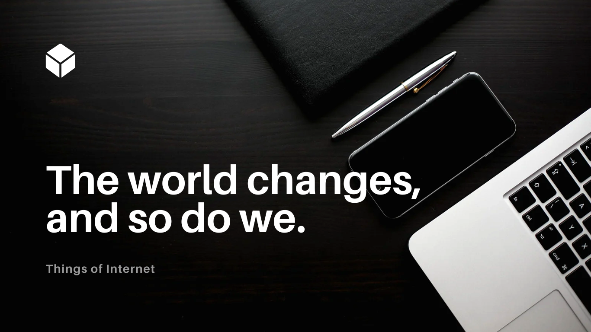

# ¡Hola Mundo! Soy Maximiliano Santander I'm a Developer in Germany.👋

Entwickler von Software mit Erfahrung in Webentwicklung und Systemadministration. Leidenschaft für die Erstellung effizienter und skalierbarer Lösungen.

📫 **Kontakt:**
- **E-Mail:** max.santander@outlook.com
- **Telefon:** +49 174 7590 459
- **Standort:** Regensburg, Deutschland

## 🛠️ Technologien und Tools

### 🗣️ Sprachen

### ⚙️ Frameworks

### 🎨 Frontend

### 🗄️ Datenbanken

### 🔧 Versionskontrolle

### 🖥️ IDEs / Editoren

### ☁️ Container & Orchestrierung

### 🔌 Weitere Tools & Services

### 💻 Systeme

## 🧑‍💻 Berufserfahrung

**RIS Web-& Software-Development GmbH & Co. KG, Regensburg**  
*Softwareentwickler*  
_Mai 2023 - Februar 2024_  
- Entwicklung von [Webanwendungen](https://ris-development.de/projekte-und-referenzen/).
- Entwicklung eines eigenen [CMS](https://github.com/MaxSantander/risdev) auf Basis von Django.  
- Implementierung von RESTful APIs, Redis-Caching und Backend-Diensten.  
- Agile Zusammenarbeit zur Bereitstellung skalierbarer, multilingualer Weblösungen.

**Werner Schmelmer GmbH & Co. KG, Sankt Englmar**  
*Auszubildender Elektroniker für Energie- und Gebäudetechnik*  
_September 2022 - April 2023_  
- Installation und Wartung elektrischer Systeme in gewerblichen Gebäuden.
- Diagnose und Behebung elektrischer Probleme.
- Zusammenarbeit mit multidisziplinären Teams in Bauprojekten.

**Principios Tour Operator, Córdoba, Argentinien**  
*Webadministrator und Co-Designer*  
_Oktober 2016 - Mai 2022_  
- Gestaltung und Pflege der [Unternehmenswebsite](http://www.principiosbrazil.com/es/default.aspx).
- Entwicklung Entwicklung einer Benutzeroberfläche für das [Reservierungsverwaltung](https://www.dropbox.com/scl/fi/xdwb0362044sfhfk39g2w/Principios-App-101.m4v?rlkey=qbmpzf2ehugzzm0sn1m8nfptx&e=1&dl=0).
- Strategien für digitales Marketing und Öffentlichkeitsarbeit.
- [Marketing/PR](https://www.instagram.com/principiostour/), Koordination von Gruppen- und Besichtigungsreisen. Kundenbesuche.

**Windsor Hotel & Tower, Córdoba, Argentinien**  
*Kundenservice und Hotelmanagement*  
_Oktober 2013 - September 2016_  
- Verwaltung von Reservierungen und Kundenservice.
- Implementierung von [Marketingstrategien](https://www.instagram.com/windsorhotel/?hl=es) und Öffentlichkeitsarbeit.
- Überwachung der täglichen Hotelabläufe.

**Córdoba Adventures/Campo Base, Córdoba/Mendoza, Argentinien**  
*Reiseleiter und Webdesigner*  
_Januar 2004 - Oktober 2013_  
- Planung und Durchführung von Touristenprogrammen.
- Gestaltung und Pflege der [Unternehmenswebsite](https://hostelcampobase.com.ar/).
- Verwaltung von Logistik und Personal.

## 🎓 Weiterbildung

**Deutsch C1 – Deutsch für Studium und Beruf**  
*Klett Sprachen (Selbststudium)*  
_Januar 2025 - Heute_

**Deutsche Sprache Niveau B1 (Vollzeit)**  
*VHS Regensburg*  
_November 2011 - November 2012_  
- Zertifizierung: B1 Goethe Institut.

**Programmierung (Analista de Sistemas - ohne Abschlussarbeit)**  
*IRESM - Universidad Tecnológica (Carlos Paz, Argentinien)*  
_Februar 2001 - November 2004_

**Sekundarschulbildung**  
*Instituto Nuestra Señora del Rosario (Bialet Massé, Argentinien)*  
_Februar 1996 - November 2000_  
- Abschluss: Hochschulzugangsberechtigung.

## 🌐 Sprachen

- **Spanisch:** Muttersprache
- **Deutsch:** B2
- **Englisch:** B2

